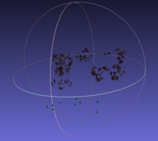
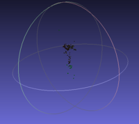
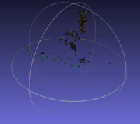

# Homework 2
## For the 3d data processing course
## By Anita Giacomin and Elettra Giacomin

---

## Report on the work done

We completed the requested code blocks in sequential order. 
The work was mostly a straightforward implementation work, with a few choices: 
- We opted for an ORB descriptor + FLANN distance matching for the features, before 
switching to a BFMatcher with Hamming distance
- We used average reprojection error as a sanity check for the current 
reconstruction state. For this purpose we reused the `ReprojectionError` functor 
written for point 5.

We evenly split the work: Anita did points 1 to 4 and the photographic data 
collection and organization, while Elettra handled points 5 to 7, running the 
code and writing the report

## Datasets results

### Images 1 (figurines)
This one ran smoothly for both applications, producing a pointcloud 
that, despite its sparsity, clearly delineates the main objects on the scene.

### Images 2 (plant)
Similar to the first dataset, with the exception that the `basic_sfm` part 
fails very often for reasons we couldn't point out.

### Ananas (pineapple)
Several pictures of a pineapple plant whose vase was set 
atop a couch. Turned out to be a poor choice for testing our 
two applications because the vast majority of detected features 
were on the plant bud, a relatively very small portion of the 
object. However, the resulting model (`ananas_pointcloud.ply`) 
clearly resembles this area of focus, to the detriment of the 
vase and the surrounding area.

### Box
Pictures of a highly textured cardboard box, attempted as a 
fallback after the previous set turned out to have disappointing results. 
Unfortunately still a bad choice of images since the matcher app 
confused the keypoints on the box and produced a file that was 
not suited to the sfm app (most of the image pairs were classified as 
having an excessive sidewards motion despite one not being present). 
No pointcloud was obtained from this set.

---

## Problems encountered
- We lost significant time due to an unforeseen problem 
with the camera calibration app: for some unknown reason it 
produces an zero-matrix as output parameters on some machines. 
This was solved by launching the program on another system. 
(With otherwise identical parameters and image set)
- The output point clouds have relatively few points and some 
runs of `basic_sfm` produce very sparse or very collapsed point sets. 
It might be necessary to run the program several times to obtain a 
good result
- We also lost several days of work due to an unexpected family emergency, 
we apologize